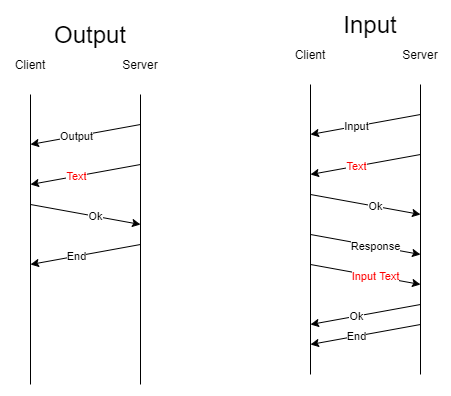
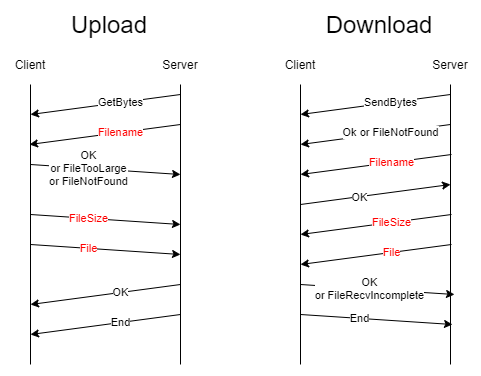

# Python Socket FileServer

Python implementation of a custom protocol to send and receive files (binary data) over the network.

For protocol specification see [protocol diagrams](#protocol-diagrams) and [implementation](/ProtocolImplementation/Protocol.py).

This is an application-layer protocol, carried by a TCP connection, that aims to turn a simple socket stream into a reliable way to transfer long files by sending start, end and control bytes, as well as defining and handling different types of error.

This multi threading server is able to manage multiple connections.

## Table of Contents

* [Usage](#usage)
* [Protocol Diagrams](#protocol-diagrams)
* [Authors](#authors)

## Usage

Server-side:
run `py server.py`

Client-side (one or multiple clients):
run `py client.py`

## Protocol diagrams

## Authors

 - Francesco Mecatti - I.T.I.S Enrico Fermi - Italy, Modena
